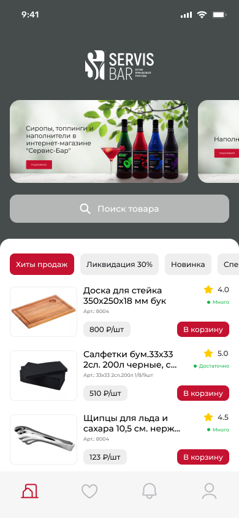
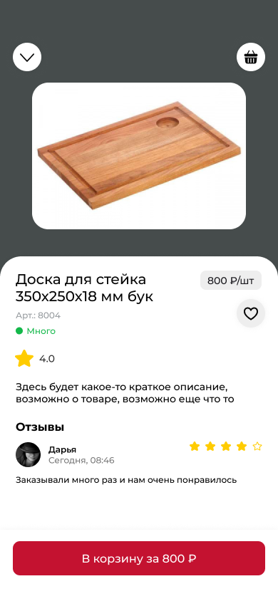
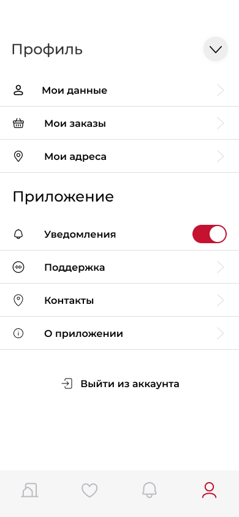

# 🍴 ServisBar — мобильное приложение доставки еды и брендовой посуды

**ServisBar** — это современное мобильное приложение для заказа брендовой посуды и доставки еды.  
Приложение позволяет удобно просматривать товары, добавлять их в корзину, формировать заказы и отслеживать статус доставки.

---

## 🚀 Возможности приложения

- 📱 **Онбординг** — приветственный экран с брендом и кратким описанием сервиса.  
- 🛒 **Главная страница** — каталог товаров и блюд с фото, ценами и описанием.  
- 📦 **Карточка товара** — подробная информация, характеристики, отзывы, возможность добавить в корзину или избранное.  
- ❤️ **Избранное** — сохранение любимых товаров для быстрого доступа.  
- 🔔 **Уведомления** — информация о скидках, акциях и статусе заказов.  
- 👤 **Профиль пользователя**:  
  - мои заказы  
  - мои данные (имя, телефон и т.д.)  
  - настройки приложения (уведомления, язык, безопасность)  
  - выход из аккаунта  
- 🛍 **Корзина** — оформление и оплата заказа.

---

## 🖼 Скриншоты интерфейса

| Онбординг | Главная | Карточка товара |
|-----------|---------|-----------------|
|  |  |  |

| Избранное | Уведомления | Профиль |
|-----------|-------------|---------|
|  |  |  |

---

## ⚙️ Технологии

- **Frontend**: Flutter (Dart)  
- **Backend**: FastAPI / Firebase (на выбор)  
- **База данных**: PostgreSQL / Firestore  
- **Авторизация**: Firebase Auth / JWT  
- **Push-уведомления**: Firebase Cloud Messaging  

---

## 📦 Установка и запуск

1. Клонировать репозиторий:
   ```bash
   git clone https://github.com/your-username/servisbar-app.git
   cd servisbar-app
